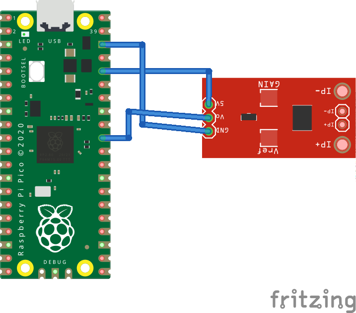

# Initial setup

- clone this repo
- connect pico to pc and configure interpreter and update micropython from Thonny
- copy [adc_power_meter.py](serial_publisher/pico/adc_power_meter.py) and [main.py](serial_publisher/pico/main.py) to Thonny backend and save it in pico
- now close Thonny and reset your pico[Your Title](your-project-name/tree/master/your-subfolder)
- the program will be saved and runs as soon as the power is connected
- pico uses `/dev/ttyACM0` port for serial communication by default check if this port is visible

# Build and run package

- build this package `colcon build`
- `source install/setup.bash`
- `ros2 run serial_publisher serial_publisher`

# Pin config

- pico (36) ----> ACS712 (VCC)
- pico (38) ----> ACS712 (GND)
- pico (31)(GPIO26 - A0) ----> ACS712 (OUT)

